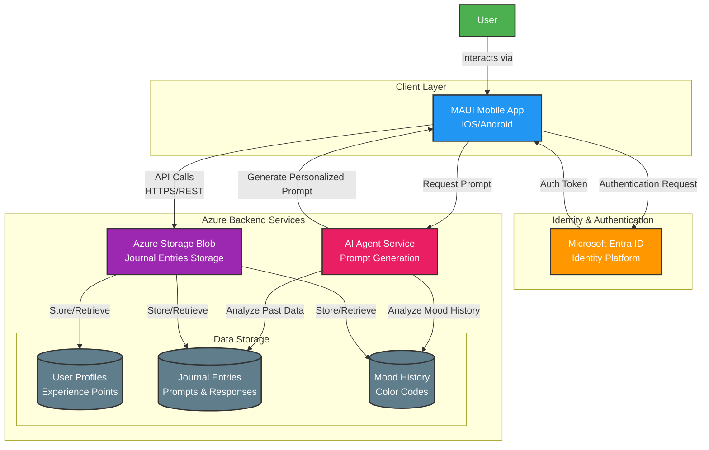

# Momentum Journaling App - System Diagram

This document contains the system architecture diagram for the Momentum daily journaling application.

## System Architecture Overview

The Momentum app is a daily journaling application built on Azure cloud infrastructure with a MAUI mobile frontend, AI-powered prompt generation, and secure identity management.

## System Diagram

## Component Details

### 1. **Client Layer**
- **MAUI Mobile App**: Cross-platform mobile application (iOS/Android)
  - Daily journal entry interface
  - 2-minute writing timer
  - Mood selection (emoji faces)
  - Calendar view with color-coded entries
  - Experience points display
  - Read-only access to past entries

### 2. **Identity & Authentication**
- **Microsoft Entra ID**: Secure user authentication and authorization
  - User identity management
  - OAuth 2.0 / OpenID Connect authentication
  - Secure token-based access
  - Single sign-on capability

### 3. **Backend Services**

#### Azure Storage Blob
- Primary data storage for all journal entries
- Secure, scalable cloud storage
- Handles:
  - Journal entry creation
  - Mood data storage
  - User profile information
  - Experience points tracking

#### AI Agent Service
- Generates personalized daily prompts
- Analyzes user's writing history
- Considers past mood patterns
- Creates contextually relevant prompts based on:
  - Previous journal entries
  - Mood trends
  - Writing patterns

### 4. **Data Storage**

#### User Profiles & Experience Points
- User account information
- Cumulative experience score
- Daily streak tracking
- User preferences

#### Journal Entries & Prompts
- Daily prompts (AI-generated)
- User responses (immutable after submission)
- Timestamp data
- Entry status (completed/locked)

#### Mood History
- Daily mood selections
- Color codes for calendar visualization
- Mood trends over time
- Analytics data for AI personalization

## Key Features Supported by Architecture

1. **Daily Prompt Generation**: AI Agent analyzes historical data to create personalized prompts
2. **Timed Writing**: Client-side 2-minute timer with auto-save
3. **Mood Tracking**: Mood data stored with journal entries for calendar visualization
4. **Immutable Entries**: Once submitted, entries are locked in storage
5. **One Entry Per Day**: Client and backend enforce daily limit
6. **Experience System**: User progress tracked in User Data storage
7. **Calendar View**: Historical entries retrieved from storage with mood-based color coding
8. **Secure Access**: Entra ID ensures only authenticated users access their data

## Data Flow

### Daily Journal Entry Flow
1. User authenticates via Entra ID
2. MAUI app requests daily prompt from AI Agent
3. AI Agent analyzes past entries and moods, generates personalized prompt
4. User writes response with 2-minute timer
5. User selects mood (emoji face)
6. Entry is saved to Azure Storage Blob (becomes immutable)
7. Experience points are awarded and updated
8. App locks for the day (no more entries allowed)

### Calendar View Flow
1. User requests calendar view
2. MAUI app queries Azure Storage for past entries
3. Storage returns journal entries with mood data
4. App displays calendar with color-coded days
5. User selects a day to view that day's prompt and response

## Security Considerations

- All API calls use HTTPS encryption
- Authentication tokens required for all backend requests
- Entra ID provides enterprise-grade security
- Azure Storage Blob provides encrypted storage at rest
- User data is isolated and access-controlled

## Scalability

- Azure Storage Blob scales automatically with user growth
- Entra ID supports large user bases
- MAUI app provides native performance on mobile devices
- AI Agent can be scaled independently based on demand

## Technology Stack

- **Frontend**: .NET MAUI (C#)
- **Backend**: Azure Storage Blob
- **Authentication**: Microsoft Entra ID
- **AI/ML**: AI Agent Service (likely Azure OpenAI or similar)
- **Cloud Platform**: Microsoft Azure
