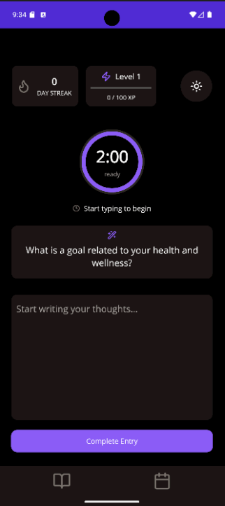
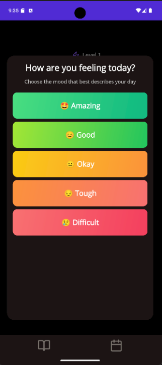
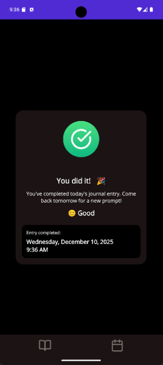
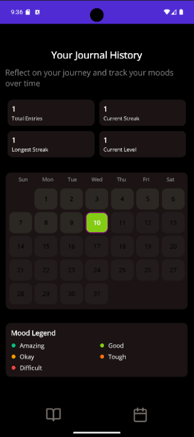
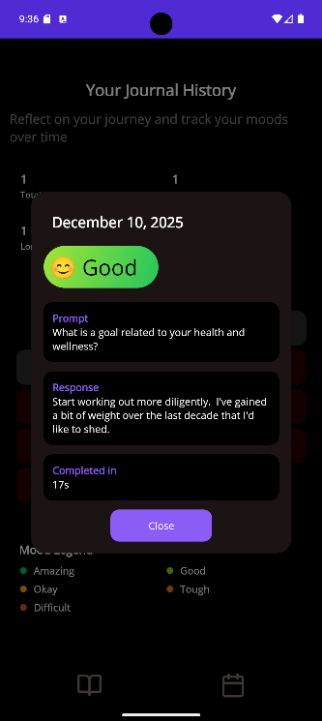

# SKRIBE — Daily Journaling (Skribe)

A .NET MAUI mobile application for daily journaling with AI-powered prompts, mood tracking, and progress visualization.

## 👉 [Installation & Testing Guide](INSTALL.md)

  

  

Summary

- Platform: .NET 10, .NET MAUI (Android, iOS / MacCatalyst, Windows)
- App title: `SKRIBE` (configured in `SkribeMaui.csproj`)

Key features (current build)

- Focused 2-minute writing timer
  - Custom circular timer control with smooth animation. The timer encourages concise daily entries and is central to the journaling flow.
  - Timer starts automatically when the user begins typing and can be completed manually.

- Prompt system
  - Daily prompts shown in a `PromptCard` above the editor to help users get started.
  - Current behavior: prompts are selected at random from an in-memory set.

- Mood selection and color-coded calendar
  - After completing an entry, the user selects a mood for that day.
  - Calendar view color-codes days by mood (configurable mapping):
    - Green: Amazing / Good
    - Yellow: Okay
    - Orange: Tough
    - Red: Difficult
  - Calendar shows a completion indicator (dot) for days with entries and lets users tap a day to view that day's entry in read-only mode.

- Experience points (XP) and leveling
  - Users earn XP for completing daily entries. The system uses a base XP value and applies a compounding streak bonus.
  - Current implementation (example):
    - Base XP per entry: 50
    - Compounding streak bonus: 10% per consecutive day in streak (multiplier = 1.1^streak)
    - Earned XP = round(baseXP * multiplier)
  - Total XP increases user level using a progressive curve (e.g., level progression derived from cumulative XP such as 100*L*(L-1)/2 to reach level L).
  - Streak tracking (current streak, longest streak) updates on successful daily completion.

- Entry model & behavior
  - One journal entry per day is enforced — once submitted entries become immutable.
  - Each entry stores: date, prompt, response text, mood, and completion time (seconds spent writing).
  - Entries are persisted in the app's storage layer.

- Theme & design
  - Dark / Light theme support with automatic switching and theme-aware colors.
  - Design system uses card surfaces, rounded corners, and a consistent color palette.

  
Future Features

- AI-generated prompts: an option to generate personalized prompts via an AI agent (configurable and opt-in).
- Cloud sync & backups: sync entries and user stats via Azure Storage or another cloud backend for multi-device continuity.
- Calendar export and analytics: export mood history and XP progress; visual analytics for streaks and writing habits.
Build & run (local)
- Push notifications to notify users to complete their entry daily.

1. Open `SkribeMaui.sln` in Visual Studio (2022/2023) or use the CLI.
2. Select target device/emulator and Run (F5) from Visual Studio.

Contributing

1. Fork the repository and create a feature branch.
2. Implement changes and open a pull request with screenshots and a short description of behavior changes.

Notes

- Entries are currently stored locally; cloud sync / backup via Azure Storage is planned as part of backend integration.
