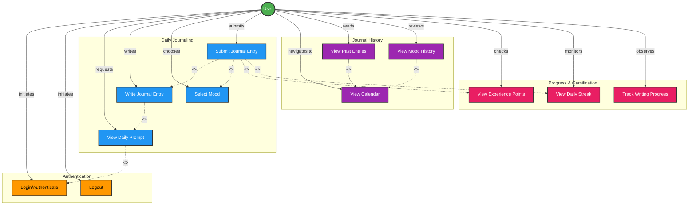

# Momentum Journaling App - Use Case Diagram

This document contains the use case diagram for the Momentum daily journaling application, showing the key interactions between users and the system.

## Use Case Diagram

## Use Case Descriptions

### Authentication

#### UC1: Login/Authenticate
- **Description**: User authenticates with the application using Microsoft Entra ID
- **Actor**: User
- **Preconditions**: User has valid credentials
- **Postconditions**: User is authenticated and has access token
- **Flow**:
  1. User opens the MAUI mobile app
  2. System redirects to Microsoft Entra ID login
  3. User provides credentials
  4. System validates credentials
  5. User receives authentication token
  6. User gains access to the app

#### UC2: Logout
- **Description**: User logs out of the application
- **Actor**: User
- **Preconditions**: User is logged in
- **Postconditions**: User session is terminated
- **Flow**:
  1. User selects logout option
  2. System invalidates authentication token
  3. User is redirected to login screen

### Daily Journaling

#### UC3: View Daily Prompt
- **Description**: User views the AI-generated personalized daily journaling prompt
- **Actor**: User
- **Preconditions**: User is authenticated
- **Postconditions**: Daily prompt is displayed
- **Flow**:
  1. User requests daily prompt
  2. System checks if user has already journaled today
  3. AI Agent analyzes past entries and mood history
  4. AI Agent generates personalized prompt
  5. System displays prompt to user

#### UC4: Write Journal Entry
- **Description**: User writes their journal entry response to the daily prompt
- **Actor**: User
- **Preconditions**: User has viewed daily prompt and hasn't written entry for today
- **Postconditions**: Journal entry draft is created
- **Flow**:
  1. User begins typing response
  2. System starts 2-minute timer
  3. User writes their thoughts
  4. Timer displays remaining time
  5. Entry is auto-saved during writing

#### UC5: Select Mood
- **Description**: User selects their current mood using emoji faces
- **Actor**: User
- **Preconditions**: User is writing or has written journal entry
- **Postconditions**: Mood is associated with journal entry
- **Flow**:
  1. User views mood selection interface (emoji faces)
  2. User selects one mood emoji
  3. System associates mood with current entry

#### UC6: Submit Journal Entry
- **Description**: User submits their completed journal entry with mood
- **Actor**: User
- **Preconditions**: User has written entry and selected mood
- **Postconditions**: Entry is permanently saved and cannot be edited
- **Flow**:
  1. User clicks submit button
  2. System validates entry completeness
  3. System saves entry to Azure Storage
  4. Entry becomes immutable (locked)
  5. Experience points are awarded
  6. Daily streak is updated
  7. App prevents additional entries for the day

### Journal History

#### UC7: View Calendar
- **Description**: User views calendar with color-coded entries based on mood
- **Actor**: User
- **Preconditions**: User is authenticated
- **Postconditions**: Calendar is displayed with mood-colored days
- **Flow**:
  1. User navigates to calendar view
  2. System retrieves all past entries
  3. System displays calendar with color-coded days
  4. Each day shows mood color if entry exists

#### UC8: View Past Entries
- **Description**: User views read-only past journal entries
- **Actor**: User
- **Preconditions**: User is viewing calendar
- **Postconditions**: Past entry is displayed
- **Flow**:
  1. User selects a day from calendar
  2. System retrieves journal entry for that day
  3. System displays prompt and response (read-only)
  4. System shows mood and timestamp

#### UC9: View Mood History
- **Description**: User reviews their mood patterns over time
- **Actor**: User
- **Preconditions**: User is viewing calendar
- **Postconditions**: Mood trends are visualized
- **Flow**:
  1. User accesses mood history view
  2. System retrieves mood data from all entries
  3. System displays mood trends and patterns
  4. User can see emotional journey over time

### Progress & Gamification

#### UC10: View Experience Points
- **Description**: User checks their accumulated experience points
- **Actor**: User
- **Preconditions**: User is authenticated
- **Postconditions**: Experience points are displayed
- **Flow**:
  1. User views experience points display
  2. System retrieves current XP from user profile
  3. System shows total points earned
  4. User sees progress towards next milestone

#### UC11: View Daily Streak
- **Description**: User monitors their consecutive days of journaling
- **Actor**: User
- **Preconditions**: User is authenticated
- **Postconditions**: Streak information is displayed
- **Flow**:
  1. User views streak display
  2. System calculates consecutive journaling days
  3. System shows current streak count
  4. User sees motivation to maintain streak

#### UC12: Track Writing Progress
- **Description**: User observes their writing duration and progress during the 2-minute timer
- **Actor**: User
- **Preconditions**: User is writing journal entry
- **Postconditions**: Progress is visualized in real-time
- **Flow**:
  1. Timer starts when user begins writing
  2. System displays countdown (2 minutes)
  3. System shows writing progress indicator
  4. User sees time remaining
  5. Timer completes after 2 minutes

## Use Case Relationships

### Include Relationships (mandatory)
- **View Daily Prompt includes Login/Authenticate**: User must be authenticated to view prompts
- **Write Journal Entry includes View Daily Prompt**: User must see prompt before writing
- **Submit Journal Entry includes Write Journal Entry**: User must write before submitting
- **Submit Journal Entry includes Select Mood**: User must select mood before submitting
- **Submit Journal Entry includes View Experience Points**: Submitting awards XP automatically
- **Submit Journal Entry includes View Daily Streak**: Submitting updates streak automatically
- **View Past Entries includes View Calendar**: User navigates through calendar to view entries
- **View Mood History includes View Calendar**: Mood history is accessed through calendar

### Extend Relationships (optional/conditional)
None currently defined. All relationships in this system are mandatory (includes).

## System Constraints

1. **One Entry Per Day**: Users can only create one journal entry per day
2. **Immutable Entries**: Once submitted, entries cannot be edited or deleted
3. **Timed Writing**: Writing session is limited to 2 minutes
4. **Authentication Required**: All use cases require valid authentication
5. **Mood Required**: Mood selection is mandatory for entry submission
6. **Read-Only History**: Past entries can only be viewed, not modified

## Actors Summary

### Primary Actor: User
- Daily journaler who uses the app for self-reflection
- Motivated by gamification (XP, streaks)
- Seeks personalized prompts and mood tracking
- Values privacy and data security

### Secondary Actors (System-level)
- **Microsoft Entra ID**: Handles authentication
- **AI Agent Service**: Generates personalized prompts
- **Azure Storage**: Persists journal data
- **Timer Service**: Manages 2-minute writing sessions

## Benefits of Use Case Model

1. **User-Centric Design**: Focuses on what users want to accomplish
2. **Clear Requirements**: Each use case defines specific functionality
3. **Relationship Mapping**: Shows dependencies between features
4. **Validation Tool**: Can be used to verify system implementation
5. **Communication**: Helps stakeholders understand app functionality
6. **Testing Guide**: Each use case can be converted to test scenarios
